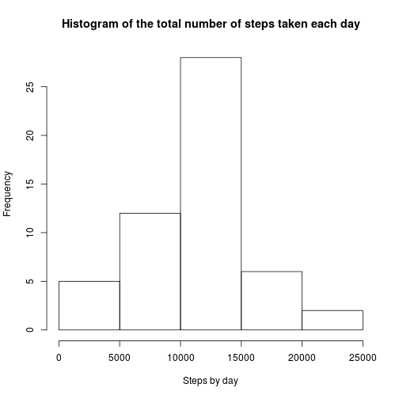
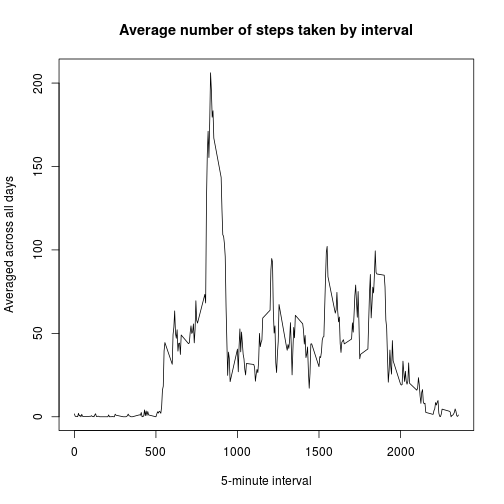
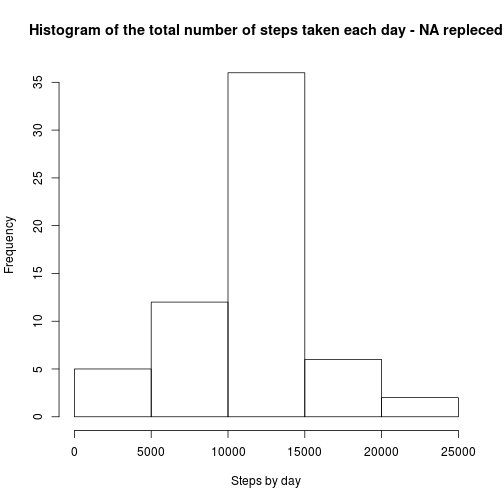
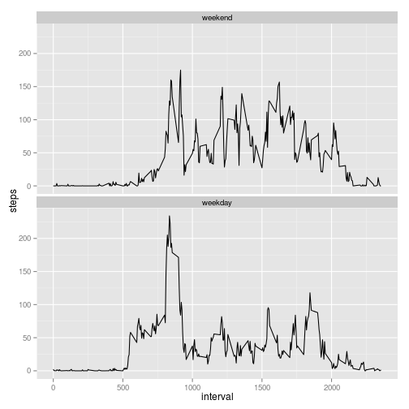

```r
# load all packages used in this exploratory analysis
library(knitr)
library(scales)
library(ggplot2)
library(xtable)
```

## Loading and preprocessing the data


```r
# load data
data <- read.csv("activity.csv")

# Transform date attribute from Factor to Date 
data$date <- as.Date(data$date)
```

## What is mean total number of steps taken per day?

1.- Calculate the total number of steps taken per day

2.- If you do not understand the difference between a histogram and a barplot, research the difference between them. Make a histogram of the total number of steps taken each day

3.- Calculate and report the mean and median of the total number of steps taken per day


```r
# remove NA in data
data2 <- data[!is.na(data$steps),]

# Calculate the total number of steps taken per day
steps_by_day <- tapply(data2$steps, data2$date,  sum)
steps_by_day
```

```
## 2012-10-02 2012-10-03 2012-10-04 2012-10-05 2012-10-06 2012-10-07 
##        126      11352      12116      13294      15420      11015 
## 2012-10-09 2012-10-10 2012-10-11 2012-10-12 2012-10-13 2012-10-14 
##      12811       9900      10304      17382      12426      15098 
## 2012-10-15 2012-10-16 2012-10-17 2012-10-18 2012-10-19 2012-10-20 
##      10139      15084      13452      10056      11829      10395 
## 2012-10-21 2012-10-22 2012-10-23 2012-10-24 2012-10-25 2012-10-26 
##       8821      13460       8918       8355       2492       6778 
## 2012-10-27 2012-10-28 2012-10-29 2012-10-30 2012-10-31 2012-11-02 
##      10119      11458       5018       9819      15414      10600 
## 2012-11-03 2012-11-05 2012-11-06 2012-11-07 2012-11-08 2012-11-11 
##      10571      10439       8334      12883       3219      12608 
## 2012-11-12 2012-11-13 2012-11-15 2012-11-16 2012-11-17 2012-11-18 
##      10765       7336         41       5441      14339      15110 
## 2012-11-19 2012-11-20 2012-11-21 2012-11-22 2012-11-23 2012-11-24 
##       8841       4472      12787      20427      21194      14478 
## 2012-11-25 2012-11-26 2012-11-27 2012-11-28 2012-11-29 
##      11834      11162      13646      10183       7047
```

```r
# Make a histogram of the total number of steps taken each day
hist(steps_by_day, main = "Histogram of the total number of steps taken each day", xlab = "Steps by day")
```

 

The mean of the total number of steps taken per day is

```r
mean(steps_by_day, na.rm = TRUE)
```

[1] 10766.19

The median of the total number of steps taken per day is

```r
median(steps_by_day, na.rm = TRUE)
```

[1] 10765

## What is the average daily activity pattern?

Make a time series plot (i.e. type = "l") of the 5-minute interval (x-axis) and the average number of steps taken, averaged across all days (y-axis)

```r
steps_by_interval <- tapply(data2$steps, data2$interval,  mean)

 plot(row.names(steps_by_interval), steps_by_interval, type = 'l', main = "Average number of steps taken by interval", xlab = "5-minute interval", ylab = "Averaged across all days")
```

 

Which 5-minute interval, on average across all the days in the dataset, contains the maximum number of steps?

```r
names(which.max(steps_by_interval))
```

```
## [1] "835"
```

## Imputing missing values

Calculate and report the total number of missing values in the dataset (i.e. the total number of rows with NAs)


```r
number_missing_values <- sum(is.na(data$steps))
```

The total number of rows with NAs is 2304

Create a new dataset that is equal to the original dataset but with the missing data filled in.

```r
data_fill <- data
 #The data is filled by mean value
data_fill[is.na(data_fill$steps),]$steps <- mean(data$steps, na.rm = TRUE)
```

Make a histogram of the total number of steps taken each day and Calculate and report the mean and median total number of steps taken per day. 

```r
# Calculate the total number of steps taken per day
steps_by_day <- tapply(data_fill$steps, data_fill$date,  sum)

# Make a histogram of the total number of steps taken each day
hist(steps_by_day, main = "Histogram of the total number of steps taken each day - NA repleced", xlab = "Steps by day")
```

 

The mean of the total number of steps taken per day is

```r
mean(steps_by_day, na.rm = TRUE)
```

[1] 10766.19

The median of the total number of steps taken per day is

```r
median(steps_by_day, na.rm = TRUE)
```

[1] 10766.19

Do these values differ from the estimates from the first part of the assignment? 
No, the values are not very differents.

What is the impact of imputing missing data on the estimates of the total daily number of steps?
Because I used the mean of values the data don't have many variation, may be with another method the changes can be more serious. 

## Are there differences in activity patterns between weekdays and weekends?

Create a new factor variable in the dataset with two levels – “weekday” and “weekend” indicating whether a given date is a weekday or weekend day.


```r
week_days <- c('lunes', 'martes', 'miércoles', 'jueves', 'viernes')
data2$week_day <- factor((weekdays(data2$date) %in% week_days), levels=c(FALSE, TRUE), labels=c('weekend', 'weekday'))
summary(data2)
```

```
##      steps             date               interval         week_day    
##  Min.   :  0.00   Min.   :2012-10-02   Min.   :   0.0   weekend: 4032  
##  1st Qu.:  0.00   1st Qu.:2012-10-16   1st Qu.: 588.8   weekday:11232  
##  Median :  0.00   Median :2012-10-29   Median :1177.5                  
##  Mean   : 37.38   Mean   :2012-10-30   Mean   :1177.5                  
##  3rd Qu.: 12.00   3rd Qu.:2012-11-16   3rd Qu.:1766.2                  
##  Max.   :806.00   Max.   :2012-11-29   Max.   :2355.0
```

Make a panel plot containing a time series plot 


```r
qplot(interval, steps, data=data2, stat="summary", fun.y="mean", geom="line", ) + facet_wrap( ~ week_day, nrow = 2, ncol = 1) 
```

 
